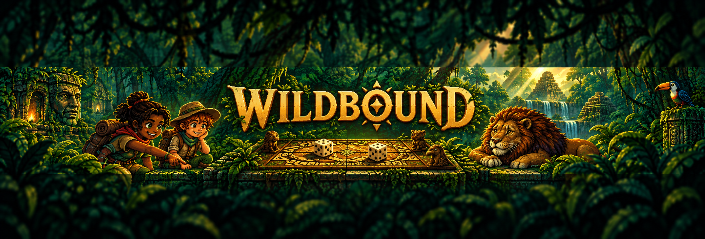
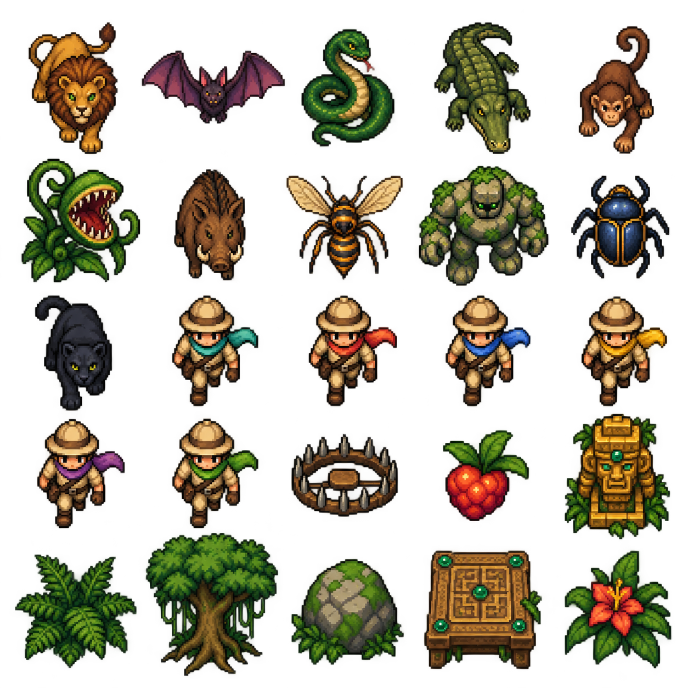
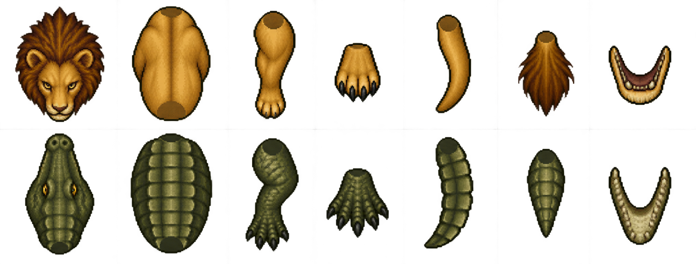

<div align="center">

# Wildbound — The Living Board

### A Jumanji-inspired local co-op roguelike where the board comes alive.

**Wildbound** is the working title for a game I am building with my son, Ember. The idea began while we were reading *Jumanji* together at bedtime: we imagined our own living board, dangerous jungle expeditions, and a story we could keep adding to.

## A game and a workshop

Wildbound is designed as a full creative workshop as well as a playable game. The goal is to keep human design and creation in the loop: the people making the game should be able to draw a character, shape a creature, tune a combat move, build a level, author an encounter, or invent a new effect and see that idea become part of the world.

Over time, the project is intended to become a standalone game that is easy to modify and extend. New characters, enemies, animations, gear, levels, environments, particles, sounds, rules, and story events should be addable through approachable tools and documented assets instead of requiring a complete rewrite of the engine. The workshop exists to make experimentation, family collaboration, and personal authorship part of the game itself.



<p>
  <strong>Latest build: 1.0.5</strong><br>
  Combat combos · jumping · temple tigers · Field Kit systems
</p>

<a href="RELEASE_REPORT_1.0.5.md">Release notes</a> ·
<a href="CHANGELOG.md">Changelog</a> ·
<a href="PLAYER_ANIMATION.md">Animation guide</a> ·
<a href="assets/FIELD_KIT_ASSETS.md">Asset manifest</a>

</div>

## Play the build

1. Launch **[Play Wildbound.cmd](Play%20Wildbound.cmd)**, or run `dist/1.0.5/Wildbound-win32-x64/Wildbound.exe`.
2. Keep the complete packaged folder together when moving or sharing the build.
3. Gather 1–6 local players, choose explorers and difficulty, then open the board and strike the table to roll.

During a solo expedition started with keyboard/mouse, use the left stick or a controller button to take over the existing hero. To add a second player during the first round, press Start/Menu on an unused controller. In the lobby, any controller button joins; reconnecting a controller reclaims a disconnected hero.

Reach space 48, hold Interact near the table to seal the jungle, and collect the shared victory chest. Unclaimed loot is recovered into that chest. Strike the board again for a new expedition. Saved equipment, personal storage, coins, appearance and loadouts persist.

## What’s in the current build

- **Living board expeditions:** shared exploration, turn order, objectives, persistent creatures, rescue events and victory chests.
- **Local co-op for 1–6 players:** keyboard/mouse and controller support with reconnectable heroes.
- **Field Kit:** trail objectives, storage, crafting, cosmetic look editing, settings, loadout management and recovery tools.
- **Combat and creatures:** charge attacks, dodge, block, traps, drag-and-revive, creature patrols and dense encounter pacing.
- **Character and rig tools:** curated looks, randomization locks, dyes, gear previews, directional wearables, animation and custom asset workflows.

## Field Kit

Open **G / right-stick click**. This pauses the local expedition while you organize. **LB/RB changes tabs; D-pad/stick moves focus; left/right changes dropdowns; A selects; B closes.** The controller that opens the kit selects its own hero.

- **Trail:** objectives, board choices, expedition boons, party pings, safe regroup and the previous expedition’s debrief.
- **Storage:** backpack, three named chests, shared stash and Recovery. Search by name, rarity or stat; filter categories; mark stacks and move them to the selected destination.
- **Craft:** turn harvested sticks, logs, stone and fruit into arrows, traps, tonics and temporary barricades.
- **Look:** eight views, animated poses, cosmetic editing, presets, party symbols, helmet visibility, dyes, relic display and stowed weapons.
- **Settings:** UI scale, board size, event duration, performance diagnostics, bindings, saving and character backup tools.

## Artwork

The repository includes the source art used by the editor and runtime. A few pieces are shown here as a quick tour:

<div align="center">

<table>
<tr>
<td></td>
<td></td>
</tr>
<tr>
<td><em>Explorer and gear concepts</em></td>
<td><em>Creature parts and rig source</em></td>
</tr>
</table>

</div>

More production art and direction sheets are in [`design/`](design/) and [`Concept Art Pixel/`](Concept%20Art%20Pixel/). Runtime-ready art references are documented in the [asset manifest](assets/FIELD_KIT_ASSETS.md).

## Default controls

| Action | Keyboard / mouse | Controller |
|---|---|---|
| Move / aim | WASD or arrows / mouse | Left / right stick |
| Attack; hold to charge | F / left click | A |
| Dodge | Space / right click | RT |
| Interact / revive | E | Y |
| Quick loot | Interact nearby | X |
| Trap | Q | L3 |
| Block | C | LT |
| Potion | H | RB |
| Backpack | I | Back |
| Storage portal | P | D-pad up |
| Board | B | LB |
| Field Kit | G | R3 |
| Pause | Escape | Start |

Gameplay bindings can be changed in the settings screen. World prompts and the Field Kit show the current bindings.

## Development

```bash
npm install
npm start
npm test
npm run test:app
npm run package
```

For browser preview use `npm run dev`. Desktop graphics acceleration is enabled by default; pass `--software-rendering` for the fallback. The full-frame comparison harness is `scripts/benchmark-full.cjs`; Field Kit smoke coverage is in `scripts/verify-field.cjs`.

The release remains focused on local co-op. Direct-network transport is experimental and has not been certified for the newest Field Kit systems. Physical controller hardware and long-session balancing still need hands-on playtesting.

## Documentation

- [1.0.5 test instructions](RELEASE_REPORT_1.0.5.md)
- [Complete implementation report](RELEASE_REPORT_0.9.0.md)
- [Player animation guide](PLAYER_ANIMATION.md)
- [Audio plan](AUDIO_PLAN_1.0.0.md)
- [Historical migration notes](docs/history/README-before-0.9.md)

## Compatibility and saves

Old character and rig migrations remain supported. Saves use validated asynchronous temporary-file writes and backups. Import adds new character IDs without replacing existing heroes; recovering a previous save has an explicit in-game confirmation.


